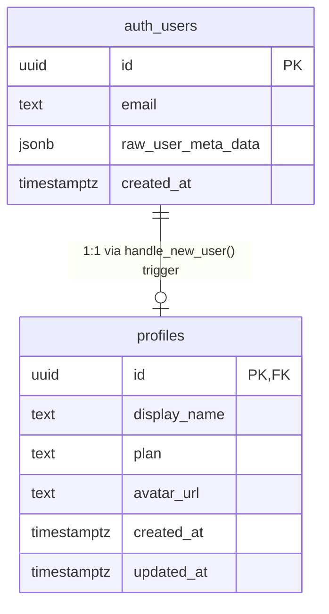
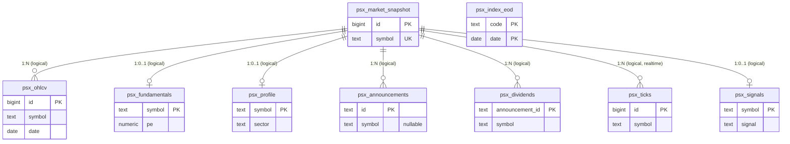
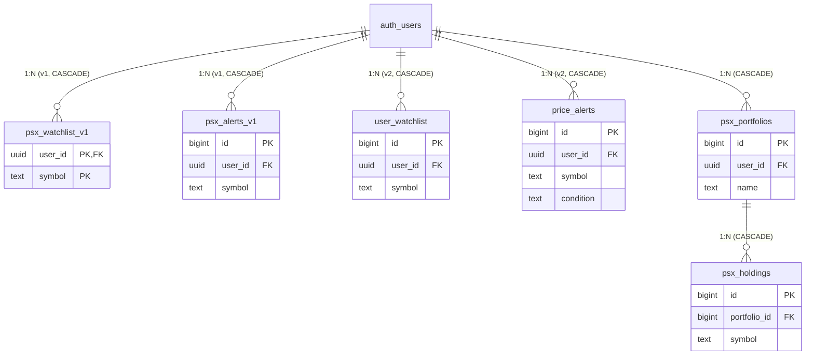
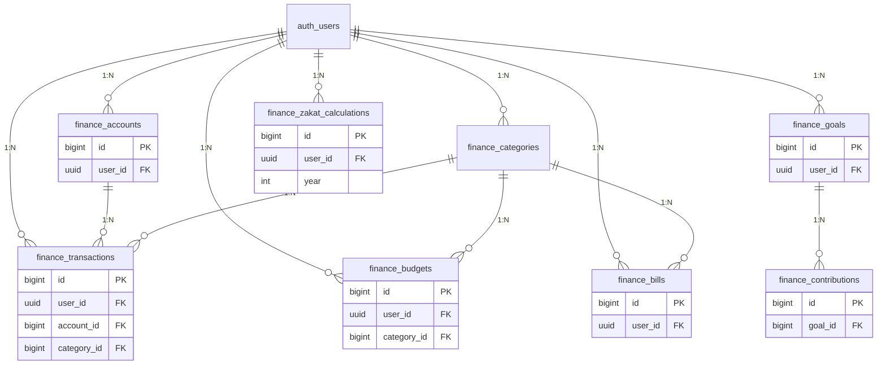
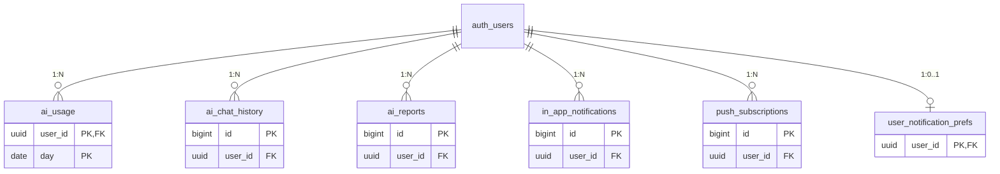
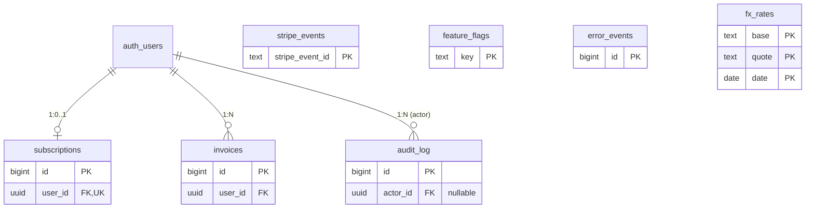

# NafaIQ — Entity Relationship Diagram (ERD)

> **Last updated:** 2026-07-07
> **Source of truth:** `supabase/migrations/*.sql`, `services/psx-api/app/**`, `src/integrations/supabase/**`
> **Status:** 16 actual tables (1 auth + 15 PSX) + 25 planned (Phases 4–9)

## How to read this diagram

**Mermaid `erDiagram` notation:**
- `||` — exactly one (mandatory)
- `o|` — zero or one (optional)
- `}o` / `o{` — zero or many
- `}|` / `|{` — one or many (mandatory)
- `--` — line connecting entities; verb describes the relationship

**Marker legend:**
- 🟢 **EXISTS** — currently in `supabase/migrations/*.sql`
- 🟡 **PLANNED (Phase N)** — from `Complete Project Plan.md`, not yet migrated

---

## Master ERD (all 41 entities)

```mermaid
erDiagram
    %% ============================================================
    %% AUTH & PROFILE (Supabase managed + 1 trigger-created table)
    %% ============================================================
    auth_users {
        uuid id PK
        text email
        timestamptz created_at
        jsonb raw_user_meta_data
    }

    profiles {
        uuid id PK,FK "CASCADE from auth.users; trigger handle_new_user()"
        text display_name
        text plan "Free|Pro|Premium|Admin"
        text avatar_url
        timestamptz created_at
        timestamptz updated_at
    }

    %% ============================================================
    %% PSX MARKET DATA (public read, service_role writes)
    %% ============================================================
    psx_market_snapshot {
        bigint id PK
        text symbol UK "UNIQUE; canonical symbol"
        numeric price "NUMERIC(12,2)"
        numeric change "NUMERIC(12,2)"
        numeric change_pct "NUMERIC(8,4)"
        bigint volume
        numeric day_high "NUMERIC(12,2)"
        numeric day_low "NUMERIC(12,2)"
        timestamptz refreshed_at
    }

    psx_ohlcv {
        bigint id PK
        text symbol
        date date
        numeric open "NUMERIC(12,2)"
        numeric high "NUMERIC(12,2)"
        numeric low "NUMERIC(12,2)"
        numeric close "NUMERIC(12,2)"
        bigint volume
    }

    psx_fundamentals {
        text symbol PK
        numeric eps "NUMERIC(12,2)"
        numeric pe "NUMERIC(8,2)"
        numeric pb "NUMERIC(8,2)"
        numeric div_yield "NUMERIC(8,4)"
        numeric payout "NUMERIC(8,4)"
        numeric roe "NUMERIC(8,4)"
        timestamptz refreshed_at
    }

    psx_profile {
        text symbol PK
        text name
        text sector
        bigint listed_shares
        bigint free_float
        timestamptz refreshed_at
    }

    psx_announcements {
        text id PK "Source-system ID from DPS"
        text symbol "NULLABLE in current migration"
        timestamptz posted_at
        text title
        text category
        text url
        text body_cached
        timestamptz refreshed_at
    }

    psx_dividends {
        text announcement_id PK
        text symbol
        date ex_date
        date announcement_date
        text payout_type
        numeric per_share "NUMERIC(10,4)"
        numeric bonus_pct "NUMERIC(10,4)"
        timestamptz refreshed_at
    }

    psx_index_eod {
        text code PK "KSE100|KSE30|KMI30|ALLSHR"
        date date PK
        numeric close "NUMERIC(12,2)"
        bigint volume
    }

    psx_ticks {
        bigint id PK
        text symbol
        timestamptz time
        numeric price "NUMERIC(12,2)"
        bigint volume
        timestamptz created_at
    }

    psx_signals {
        text symbol PK,UK
        text signal "STRONG BUY|BUY|HOLD|SELL|STRONG SELL (no CHECK in SQL)"
        numeric confidence "NUMERIC(5,2)"
        jsonb probabilities
        text_array features_used
        text model_version
        timestamptz predicted_at
    }

    %% ============================================================
    %% USER PSX (RLS, per-user) — v1 (psx_*) and v2 (user_*, price_*) coexist
    %% ============================================================
    psx_watchlist_v1 {
        uuid user_id PK,FK "CASCADE"
        text symbol PK
        timestamptz created_at
    }

    psx_alerts_v1 {
        bigint id PK
        uuid user_id FK "CASCADE"
        text symbol
        text type
        text condition
        numeric threshold "NUMERIC(12,4)"
        boolean enabled
        timestamptz created_at
    }

    user_watchlist {
        bigint id PK
        uuid user_id FK "CASCADE"
        text symbol
        timestamptz added_at
    }

    price_alerts {
        bigint id PK
        uuid user_id FK "CASCADE"
        text symbol
        text condition "CHECK IN (above,below,cross_above,cross_below)"
        numeric price "NUMERIC(14,2)"
        boolean enabled
        timestamptz triggered_at
        timestamptz created_at
    }

    psx_portfolios {
        bigint id PK
        uuid user_id FK "CASCADE"
        text name
        timestamptz created_at
    }

    psx_holdings {
        bigint id PK
        bigint portfolio_id FK "CASCADE"
        text symbol
        bigint shares
        numeric avg_cost "NUMERIC(12,2)"
        date purchased_at
    }

    %% ============================================================
    %% PLANNED: FINANCE MODULE (Phase 4)
    %% ============================================================
    finance_accounts {
        bigint id PK
        uuid user_id FK
        text name
        text type "cash|bank|wallet|crypto|investment"
        numeric balance
        text currency
        timestamptz created_at
    }

    finance_categories {
        bigint id PK
        uuid user_id FK
        text name
        text icon
        text color
        text kind "income|expense"
        timestamptz created_at
    }

    finance_transactions {
        bigint id PK
        uuid user_id FK
        bigint account_id FK
        bigint category_id FK
        numeric amount
        text direction "income|expense|transfer"
        timestamptz occurred_at
        text description
        text merchant
        text symbol FK "optional — links investment txns to PSX"
        text_array tags
        text receipt_url
        timestamptz created_at
        timestamptz updated_at
    }

    finance_budgets {
        bigint id PK
        uuid user_id FK
        bigint category_id FK
        date month "First day of month"
        numeric limit_amount
        timestamptz created_at
    }

    finance_bills {
        bigint id PK
        uuid user_id FK
        text name
        numeric amount
        text frequency "monthly|weekly|quarterly|yearly"
        date next_due
        bigint category_id FK
        text merchant
        boolean auto_pay
        timestamptz created_at
    }

    finance_goals {
        bigint id PK
        uuid user_id FK
        text name
        numeric target_amount
        numeric current_amount
        date target_date
        text icon
        timestamptz created_at
    }

    finance_contributions {
        bigint id PK
        bigint goal_id FK
        numeric amount
        text note
        timestamptz contributed_at
    }

    finance_zakat_calculations {
        bigint id PK
        uuid user_id FK
        int year
        numeric cash_on_hand
        numeric receivables
        numeric investments
        numeric inventory
        numeric liabilities
        numeric nisab_threshold
        numeric zakat_due
        timestamptz calculated_at
    }

    %% ============================================================
    %% PLANNED: NOTIFICATIONS (Phase 4)
    %% ============================================================
    user_notification_prefs {
        uuid user_id PK,FK
        boolean email_alerts
        boolean push_alerts
        boolean in_app_alerts
        boolean email_bills
        boolean email_budgets
        boolean email_goals
    }

    in_app_notifications {
        bigint id PK
        uuid user_id FK
        text kind "price_alert|bill|budget|goal|system"
        text title
        text body
        text link
        boolean read
        timestamptz created_at
    }

    push_subscriptions {
        bigint id PK
        uuid user_id FK
        text endpoint
        text p256dh
        text auth
        timestamptz created_at
    }

    %% ============================================================
    %% PLANNED: FX + PORTFOLIO (Phase 5)
    %% ============================================================
    fx_rates {
        text base PK "PKR|USD|AED|SAR|EUR|GBP"
        text quote PK
        date date PK
        numeric rate
    }

    %% ============================================================
    %% PLANNED: AI (Phase 6)
    %% ============================================================
    ai_usage {
        uuid user_id PK,FK
        date day PK
        int tutor_count
        int report_count
        int tokens_used
    }

    ai_chat_history {
        bigint id PK
        uuid user_id FK
        text lesson_id "Nullable — free-form chat allowed"
        text role "user|assistant|system"
        text content
        int tokens_used
        text model
        timestamptz created_at
    }

    ai_reports {
        bigint id PK
        uuid user_id FK
        text kind "portfolio|finance|stock|market_brief"
        text title
        text content
        jsonb context
        timestamptz created_at
    }

    %% ============================================================
    %% PLANNED: BILLING (Phase 8)
    %% ============================================================
    subscriptions {
        bigint id PK
        uuid user_id FK,UK
        text stripe_customer_id UK
        text stripe_subscription_id UK
        text plan
        text status
        timestamptz current_period_start
        timestamptz current_period_end
        boolean cancel_at_period_end
        timestamptz canceled_at
        timestamptz created_at
        timestamptz updated_at
    }

    invoices {
        bigint id PK
        uuid user_id FK
        text stripe_invoice_id UK
        numeric amount_paid
        text currency
        text status
        text hosted_url
        timestamptz created_at
    }

    stripe_events {
        text stripe_event_id PK
        text type
        jsonb data
        timestamptz received_at
    }

    %% ============================================================
    %% PLANNED: AUDIT / FLAGS (Phase 9)
    %% ============================================================
    audit_log {
        bigint id PK
        uuid actor_id FK "Nullable"
        text action
        text entity_type
        bigint entity_id
        jsonb metadata
        timestamptz created_at
    }

    feature_flags {
        text key PK
        boolean enabled
        jsonb rules
        timestamptz updated_at
    }

    error_events {
        bigint id PK
        text source "frontend|backend|api"
        text level "info|warning|error|fatal"
        text message
        jsonb context
        text request_id
        timestamptz created_at
    }

    %% ============================================================
    %% RELATIONSHIPS — EXISTING (declared FKs in SQL)
    %% ============================================================
    auth_users ||--o| profiles : "1:1 via trigger"
    auth_users ||--o{ psx_watchlist_v1 : "owns (v1, CASCADE)"
    auth_users ||--o{ psx_alerts_v1 : "owns (v1, CASCADE)"
    auth_users ||--o{ user_watchlist : "owns (v2, CASCADE)"
    auth_users ||--o{ price_alerts : "owns (v2, CASCADE)"
    auth_users ||--o{ psx_portfolios : "owns (CASCADE)"
    psx_portfolios ||--o{ psx_holdings : "contains (CASCADE)"

    %% ============================================================
    %% RELATIONSHIPS — EXISTING (logical, no FK declared in SQL)
    %% These rely on UNIQUE on psx_market_snapshot(symbol) and
    %% are enforced at the application layer by the Python service.
    %% ============================================================
    psx_market_snapshot ||--o{ psx_ohlcv : "history of (logical)"
    psx_market_snapshot ||--o| psx_fundamentals : "has (logical, PK = symbol)"
    psx_market_snapshot ||--o| psx_profile : "identified by (logical, PK = symbol)"
    psx_market_snapshot ||--o{ psx_announcements : "announces (logical)"
    psx_market_snapshot ||--o{ psx_dividends : "pays (logical)"
    psx_market_snapshot ||--o{ psx_ticks : "ticks for (logical)"
    psx_market_snapshot ||--o| psx_signals : "signal for (logical, PK = symbol)"

    psx_market_snapshot ||--o{ psx_watchlist_v1 : "tracked in (logical)"
    psx_market_snapshot ||--o{ psx_alerts_v1 : "alerts on (logical)"
    psx_market_snapshot ||--o{ user_watchlist : "tracked in (logical)"
    psx_market_snapshot ||--o{ price_alerts : "alerts on (logical)"
    psx_market_snapshot ||--o{ psx_holdings : "valued at (logical)"

    %% ============================================================
    %% RELATIONSHIPS — PLANNED
    %% ============================================================
    auth_users ||--o{ finance_accounts : "owns"
    auth_users ||--o{ finance_categories : "owns"
    auth_users ||--o{ finance_transactions : "owns"
    auth_users ||--o{ finance_budgets : "owns"
    auth_users ||--o{ finance_bills : "owns"
    auth_users ||--o{ finance_goals : "owns"
    auth_users ||--o{ finance_zakat_calculations : "owns"
    auth_users ||--o| user_notification_prefs : "configures"
    auth_users ||--o{ in_app_notifications : "receives"
    auth_users ||--o{ push_subscriptions : "registers"
    auth_users ||--o{ ai_usage : "tracked via"
    auth_users ||--o{ ai_chat_history : "creates"
    auth_users ||--o{ ai_reports : "receives"
    auth_users ||--o| subscriptions : "has"
    auth_users ||--o{ invoices : "issued"
    auth_users ||--o{ audit_log : "performed (actor)"

    finance_accounts ||--o{ finance_transactions : "source of"
    finance_categories ||--o{ finance_transactions : "tagged by"
    finance_categories ||--o{ finance_budgets : "limits"
    finance_categories ||--o{ finance_bills : "categorized as"
    finance_goals ||--o{ finance_contributions : "funded by"
    finance_transactions }o--o| psx_market_snapshot : "may link to (planned)"
```



---

## Domain-grouped view (smaller, easier to read)

### Group 1 — Auth & Profile (🟢 EXISTS)



### Group 2 — PSX Market Data (🟢 EXISTS, 9 tables)



### Group 3 — User PSX (🟢 EXISTS, v1 + v2 coexist)



### Group 4 — Finance Module (🟡 PLANNED, Phase 4)



### Group 5 — AI (🟡 PLANNED, Phase 6) + Notifications (🟡 PLANNED, Phase 4)



### Group 6 — Billing (🟡 PLANNED, Phase 8) + Ops (🟡 PLANNED, Phase 9) + FX (🟡 PLANNED, Phase 5)



---

## Existing tables — exact column-level detail

This is the canonical reference for what's in the database today. Cross-checked against `supabase/migrations/*.sql`.

### 1. `auth.users` (Supabase managed)

| Column | Type | Nullable | Default | Notes |
|---|---|---|---|---|
| `id` | `uuid` | NO | `gen_random_uuid()` | PK |
| `email` | `text` | NO | — | |
| `created_at` | `timestamptz` | NO | `now()` | |
| `raw_user_meta_data` | `jsonb` | YES | `null` | display_name, avatar_url etc. |

Trigger: `on_auth_user_created` → `handle_new_user()` inserts a `profiles` row.

### 2. `profiles` 🟢

| Column | Type | Nullable | Default | Notes |
|---|---|---|---|---|
| `id` | `uuid` | NO | — | PK, **FK → auth.users(id) ON DELETE CASCADE** |
| `display_name` | `text` | YES | `null` | |
| `plan` | `text` | NO | `'Free'` | |
| `avatar_url` | `text` | YES | `null` | |
| `created_at` | `timestamptz` | NO | `now()` | |
| `updated_at` | `timestamptz` | NO | `now()` | Trigger `update_profiles_updated_at` |

**RLS:** `USING (auth.uid() = id)` for SELECT, INSERT, UPDATE.
**GRANTS:** `SELECT, INSERT, UPDATE, DELETE TO authenticated`; `ALL TO service_role`.

### 3. `psx_market_snapshot` 🟢

| Column | Type | Nullable | Default | Notes |
|---|---|---|---|---|
| `id` | `bigint` | NO | `GENERATED BY DEFAULT AS IDENTITY` | **PK** |
| `symbol` | `text` | NO | — | **UNIQUE** (not PK) |
| `price` | `numeric(12,2)` | YES | `null` | |
| `change` | `numeric(12,2)` | YES | `null` | |
| `change_pct` | `numeric(8,4)` | YES | `null` | |
| `volume` | `bigint` | YES | `0` | |
| `day_high` | `numeric(12,2)` | YES | `null` | |
| `day_low` | `numeric(12,2)` | YES | `null` | |
| `refreshed_at` | `timestamptz` | NO | `now()` | |

**Indexes:** `idx_psx_ms_sym(symbol)`, `idx_psx_ms_refreshed(refreshed_at DESC)`.
**Realtime:** enabled via `ALTER PUBLICATION supabase_realtime ADD TABLE`.
**RLS:** `FOR SELECT USING (true)` (public).
**GRANTS:** `SELECT TO anon, authenticated`; `ALL TO service_role`.

### 4. `psx_ohlcv` 🟢

| Column | Type | Nullable | Default | Notes |
|---|---|---|---|---|
| `id` | `bigint` | NO | `GENERATED BY DEFAULT AS IDENTITY` | PK |
| `symbol` | `text` | NO | — | UNIQUE(symbol, date) |
| `date` | `date` | NO | — | |
| `open` | `numeric(12,2)` | YES | `0` | |
| `high` | `numeric(12,2)` | YES | `0` | |
| `low` | `numeric(12,2)` | YES | `0` | |
| `close` | `numeric(12,2)` | YES | `0` | |
| `volume` | `bigint` | YES | `0` | |

**Indexes:** `idx_psx_ohlcv_sym_date(symbol, date)`.
**RLS:** `FOR SELECT USING (true)`. **GRANTS:** `SELECT TO anon, authenticated`; `ALL TO service_role`.

### 5. `psx_fundamentals` 🟢

| Column | Type | Nullable | Default | Notes |
|---|---|---|---|---|
| `symbol` | `text` | NO | — | **PK** |
| `eps` | `numeric(12,2)` | YES | `null` | |
| `pe` | `numeric(8,2)` | YES | `null` | |
| `pb` | `numeric(8,2)` | YES | `null` | |
| `div_yield` | `numeric(8,4)` | YES | `null` | |
| `payout` | `numeric(8,4)` | YES | `null` | |
| `roe` | `numeric(8,4)` | YES | `null` | |
| `refreshed_at` | `timestamptz` | NO | `now()` | |

**RLS:** public read. **GRANTS:** `SELECT TO anon, authenticated`; `ALL TO service_role`.

### 6. `psx_profile` 🟢

| Column | Type | Nullable | Default | Notes |
|---|---|---|---|---|
| `symbol` | `text` | NO | — | **PK** |
| `name` | `text` | NO | `''` | |
| `sector` | `text` | YES | `null` | |
| `listed_shares` | `bigint` | YES | `null` | |
| `free_float` | `bigint` | YES | `null` | |
| `refreshed_at` | `timestamptz` | NO | `now()` | |

**RLS:** public read. **GRANTS:** `SELECT TO anon, authenticated`; `ALL TO service_role`.

### 7. `psx_announcements` 🟢

| Column | Type | Nullable | Default | Notes |
|---|---|---|---|---|
| `id` | `text` | NO | — | **PK** (source-system ID) |
| `symbol` | `text` | **YES** | `null` | ⚠️ no FK declared in SQL |
| `posted_at` | `timestamptz` | NO | `now()` | |
| `title` | `text` | NO | `''` | |
| `category` | `text` | YES | `null` | |
| `url` | `text` | YES | `null` | |
| `body_cached` | `text` | YES | `null` | |
| `refreshed_at` | `timestamptz` | NO | `now()` | |

**Indexes:** `idx_psx_ann_sym(symbol, posted_at DESC)`, `idx_psx_ann_posted(posted_at DESC)`.
**RLS:** public read.

### 8. `psx_dividends` 🟢

| Column | Type | Nullable | Default | Notes |
|---|---|---|---|---|
| `announcement_id` | `text` | NO | — | **PK** |
| `symbol` | `text` | NO | — | ⚠️ no FK declared in SQL |
| `ex_date` | `date` | YES | `null` | |
| `announcement_date` | `date` | YES | `null` | |
| `payout_type` | `text` | YES | `null` | |
| `per_share` | `numeric(10,4)` | YES | `null` | |
| `bonus_pct` | `numeric(10,4)` | YES | `null` | |
| `refreshed_at` | `timestamptz` | NO | `now()` | |

**Indexes:** `idx_psx_div_sym(symbol, ex_date DESC)`.
**RLS:** public read.

### 9. `psx_index_eod` 🟢

| Column | Type | Nullable | Default | Notes |
|---|---|---|---|---|
| `code` | `text` | NO | — | **PK (composite)** — `KSE100\|KSE30\|KMI30\|ALLSHR` |
| `date` | `date` | NO | — | **PK (composite)** |
| `close` | `numeric(12,2)` | YES | `0` | |
| `volume` | `bigint` | YES | `null` | |

**Indexes:** `idx_psx_idx_code(code, date)`.
**RLS:** public read.

### 10. `psx_ticks` 🟢

| Column | Type | Nullable | Default | Notes |
|---|---|---|---|---|
| `id` | `bigint` | NO | `GENERATED BY DEFAULT AS IDENTITY` | PK |
| `symbol` | `text` | NO | — | |
| `time` | `timestamptz` | NO | `now()` | |
| `price` | `numeric(12,2)` | YES | `null` | |
| `volume` | `bigint` | YES | `0` | |
| `created_at` | `timestamptz` | NO | `now()` | |

**Indexes:** `idx_psx_tick_sym_time(symbol, time DESC)`.
**Replica Identity:** `FULL` (required for Supabase Realtime broadcast on inserts).
**RLS:** public read.

### 11. `psx_signals` 🟢

| Column | Type | Nullable | Default | Notes |
|---|---|---|---|---|
| `symbol` | `text` | NO | — | **PK, UNIQUE** |
| `signal` | `text` | NO | — | ⚠️ no CHECK in SQL — values: `STRONG BUY\|BUY\|HOLD\|SELL\|STRONG SELL` |
| `confidence` | `numeric(5,2)` | NO | — | |
| `probabilities` | `jsonb` | YES | `null` | |
| `features_used` | `text[]` | YES | `null` | |
| `model_version` | `text` | YES | `null` | |
| `predicted_at` | `timestamptz` | NO | `now()` | |

**Indexes:** `idx_psx_signals_confidence(confidence DESC)`, `idx_psx_signals_predicted(predicted_at DESC)`.
**RLS:** public read.

### 12. `psx_watchlist` (v1) 🟢 — superseded by `user_watchlist`

| Column | Type | Nullable | Default | Notes |
|---|---|---|---|---|
| `user_id` | `uuid` | NO | — | **PK (composite)**, FK → `auth.users(id) ON DELETE CASCADE` |
| `symbol` | `text` | NO | — | **PK (composite)** |
| `created_at` | `timestamptz` | NO | `now()` | |

**RLS:** `FOR ALL TO authenticated USING (auth.uid() = user_id)`. **GRANTS:** `ALL TO authenticated`.

### 13. `psx_alerts` (v1) 🟢 — superseded by `price_alerts`

| Column | Type | Nullable | Default | Notes |
|---|---|---|---|---|
| `id` | `bigint` | NO | `GENERATED BY DEFAULT AS IDENTITY` | PK |
| `user_id` | `uuid` | YES | `null` | FK → `auth.users(id) ON DELETE CASCADE` |
| `symbol` | `text` | NO | — | |
| `type` | `text` | NO | — | v1: separate `type` column (e.g., `price`/`volume`) |
| `condition` | `text` | NO | — | |
| `threshold` | `numeric(12,4)` | YES | `null` | v1: `threshold` (renamed to `price` in v2) |
| `enabled` | `boolean` | NO | `true` | |
| `created_at` | `timestamptz` | NO | `now()` | |

**Indexes:** `idx_psx_alerts_user(user_id, symbol)`.
**RLS:** users own their alerts. **GRANTS:** `ALL TO authenticated`.

### 14. `user_watchlist` (v2) 🟢

| Column | Type | Nullable | Default | Notes |
|---|---|---|---|---|
| `id` | `bigint` | NO | `GENERATED BY DEFAULT AS IDENTITY` | PK |
| `user_id` | `uuid` | NO | — | FK → `auth.users(id) ON DELETE CASCADE` |
| `symbol` | `text` | NO | — | |
| `added_at` | `timestamptz` | NO | `now()` | |

**Indexes:** `idx_user_watchlist_user(user_id)`, `UNIQUE(user_id, symbol)`.
**RLS:** `FOR ALL TO authenticated USING (user_id = auth.uid()) WITH CHECK (user_id = auth.uid())`.

### 15. `price_alerts` (v2) 🟢

| Column | Type | Nullable | Default | Notes |
|---|---|---|---|---|
| `id` | `bigint` | NO | `GENERATED BY DEFAULT AS IDENTITY` | PK |
| `user_id` | `uuid` | NO | — | FK → `auth.users(id) ON DELETE CASCADE` |
| `symbol` | `text` | NO | — | |
| `condition` | `text` | NO | — | **CHECK**: `IN ('above','below','cross_above','cross_below')` |
| `price` | `numeric(14,2)` | NO | — | |
| `enabled` | `boolean` | NO | `true` | |
| `triggered_at` | `timestamptz` | YES | `null` | |
| `created_at` | `timestamptz` | NO | `now()` | |

**Indexes:** `idx_price_alerts_user(user_id)`, `idx_price_alerts_enabled(enabled) WHERE enabled = true`, `UNIQUE` not declared.
**RLS:** users own their alerts.

### 16. `psx_portfolios` 🟢

| Column | Type | Nullable | Default | Notes |
|---|---|---|---|---|
| `id` | `bigint` | NO | `GENERATED BY DEFAULT AS IDENTITY` | PK |
| `user_id` | `uuid` | YES | `null` | FK → `auth.users(id) ON DELETE CASCADE` |
| `name` | `text` | NO | — | |
| `created_at` | `timestamptz` | NO | `now()` | |

**RLS:** `FOR ALL TO authenticated USING (auth.uid() = user_id)`.

### 17. `psx_holdings` 🟢

| Column | Type | Nullable | Default | Notes |
|---|---|---|---|---|
| `id` | `bigint` | NO | `GENERATED BY DEFAULT AS IDENTITY` | PK |
| `portfolio_id` | `bigint` | YES | `null` | FK → `psx_portfolios(id) ON DELETE CASCADE` |
| `symbol` | `text` | NO | — | |
| `shares` | `bigint` | NO | `0` | |
| `avg_cost` | `numeric(12,2)` | NO | `0` | |
| `purchased_at` | `date` | YES | `null` | |

**Constraints:** `UNIQUE(portfolio_id, symbol)`.
**RLS:** via parent portfolio ownership — `EXISTS (SELECT 1 FROM psx_portfolios WHERE id = psx_holdings.portfolio_id AND user_id = auth.uid())`.

> **Note:** Counting the v1 + v2 split as separate conceptual tables, we have 16 actual user-data tables (1 auth + 15 PSX) plus the Supabase-managed `auth.users`.

---

## Referential integrity — current state

### FKs **actually declared** in SQL (8 total)

| Parent | → Child | On Delete |
|---|---|---|
| `auth.users` | `profiles` | CASCADE |
| `auth.users` | `psx_watchlist` (v1) | CASCADE |
| `auth.users` | `psx_alerts` (v1) | CASCADE |
| `auth.users` | `user_watchlist` (v2) | CASCADE |
| `auth.users` | `price_alerts` (v2) | CASCADE |
| `auth.users` | `psx_portfolios` | CASCADE |
| `psx_portfolios` | `psx_holdings` | CASCADE |

### Logical relationships (no FK in SQL — app-layer enforced)

These rely on `UNIQUE` on `psx_market_snapshot(symbol)` and are joined in the Python service:

- `psx_market_snapshot` ← `psx_ohlcv.symbol`
- `psx_market_snapshot` ← `psx_fundamentals.symbol` (PK = symbol, technically 1:1 with snapshot)
- `psx_market_snapshot` ← `psx_profile.symbol`
- `psx_market_snapshot` ← `psx_announcements.symbol`
- `psx_market_snapshot` ← `psx_dividends.symbol`
- `psx_market_snapshot` ← `psx_ticks.symbol`
- `psx_market_snapshot` ← `psx_signals.symbol` (PK = symbol)
- `psx_market_snapshot` ← `psx_watchlist.symbol`
- `psx_market_snapshot` ← `psx_alerts.symbol`
- `psx_market_snapshot` ← `user_watchlist.symbol`
- `psx_market_snapshot` ← `price_alerts.symbol`
- `psx_market_snapshot` ← `psx_holdings.symbol`

> ⚠️ **Recommended Phase 1 fix:** Add explicit `FOREIGN KEY (symbol) REFERENCES psx_market_snapshot(symbol)` to all child tables to enforce referential integrity at the DB level rather than relying on the Python service.

---

## CHECK constraints

Only one currently in SQL:

| Table | Constraint |
|---|---|
| `price_alerts` | `condition IN ('above','below','cross_above','cross_below')` |

**Recommended Phase 1 add:** `psx_signals.signal IN ('STRONG BUY','BUY','HOLD','SELL','STRONG SELL')`.

---

## RLS policies (actual SQL)

### `profiles`
- SELECT: `USING (auth.uid() = id)`
- INSERT: `WITH CHECK (auth.uid() = id)`
- UPDATE: `USING (auth.uid() = id) WITH CHECK (auth.uid() = id)`

### All `psx_*` public-read tables (market data)
- SELECT: `USING (true)` — open to `anon` and `authenticated`

### `psx_watchlist` (v1)
- ALL: `USING (auth.uid() = user_id)` — to `authenticated`

### `psx_alerts` (v1)
- ALL: `USING (auth.uid() = user_id)` — to `authenticated`

### `user_watchlist` (v2)
- ALL: `USING (user_id = auth.uid()) WITH CHECK (user_id = auth.uid())` — to `authenticated`

### `price_alerts` (v2)
- ALL: `USING (user_id = auth.uid()) WITH CHECK (user_id = auth.uid())` — to `authenticated`

### `psx_portfolios`
- ALL: `USING (auth.uid() = user_id)` — to `authenticated`

### `psx_holdings`
- ALL: `USING (EXISTS (SELECT 1 FROM psx_portfolios WHERE id = psx_holdings.portfolio_id AND user_id = auth.uid()))` — to `authenticated`

---

## Cardinality cheat sheet

| Notation | Meaning | Example |
|---|---|---|
| `\|\|--\|\|` | 1:1 mandatory | `auth_users \|\|--\|\| profiles` |
| `\|\|--o\|` | 1:0..1 | `auth_users \|\|--o\| subscriptions` (planned) |
| `\|\|--o{` | 1:N | `psx_portfolios \|\|--o{ psx_holdings` |
| `}o--o{` | M:N (mediated) | `user_watchlist }o--o{ psx_market_snapshot` |
| `}o--\|\|` | N:1 (mandatory) | `psx_holdings }o--\|\| psx_market_snapshot` (logical) |

---

## Cross-entity data flows

**1. User opens `/psx/HBL` (stock detail page):**
```
psx_market_snapshot (HBL) ──┐
psx_fundamentals  (HBL) ────┤
psx_profile       (HBL) ────┼──►  Frontend stock-detail page
psx_announcements (HBL) ────┤
psx_dividends     (HBL) ────┤
psx_signals       (HBL) ────┘
```

**2. User adds a holding to portfolio:**
```
psx_holdings (insert)
  ├─ portfolio_id ──► psx_portfolios (FK, validates ownership)
  └─ symbol ──► psx_market_snapshot (logical, app-validated)
```

**3. Price alert triggers (job_check_alerts, 60s):**
```
job_check_alerts (60s cron)
  └─► price_alerts (enabled=true, triggered_at IS NULL)
        └─► compare snapshot.price vs alert.price
              └─► on match: notifier.send_email/push
                    └─► price_alerts.triggered_at = now(), enabled = false
```

**4. ML signal prediction (job_refresh_signals, 4h TTL):**
```
SignalEngine.predict(symbol)
  ├─► psx_ohlcv  (last 300 bars)
  ├─► psx_fundamentals (P/E)
  └─► compute_features → model.predict
        └─► psx_signals (UPSERT on conflict=symbol)
```

**5. User upgrades to Pro (Phase 8, planned):**
```
Stripe Checkout
  └─► Stripe webhook → /api/stripe/webhook
        └─► subscriptions (UPSERT)
              └─► profiles.plan = 'Pro' (mirror)
                    └─► usePlanFeatures() hook re-fetches
                          └─► All gated features unlock
```

---

## Render the diagram

**In GitHub:** Open this file — Mermaid renders natively.
**In VS Code:** Install the "Markdown Preview Mermaid Support" extension.
**Standalone:** Paste any `mermaid` block into https://mermaid.live to export PNG/SVG.
**In dbdiagram.io:** Use the companion `docs/erd.dbml`.

## File location

- `docs/erd.md` — this file (Mermaid format)
- `docs/erd.dbml` — DBML format (for dbdiagram.io)
- `docs/erd-reference.md` — quick reference card (notation, RLS, cascades)
- `supabase/migrations/*.sql` — source of truth
- `Complete Project Plan.md` — roadmap showing phases 0–9
