# NafaIQ — Supabase Database Schema (Design)

Proposed production schema for the shared Supabase backend serving the web app
(`zenith-main`) and this mobile app. Derived from a full scan of both frontends'
TypeScript interfaces, mock data, stores, and forms (July 2026).

**Status: design only — not yet migrated.** Today only `public.profiles` exists;
everything else lives in mock seeds + AsyncStorage/localStorage
(`nafaiq:finance:v1`, `nafaiq:budgets:v1`, `nafaiq:holdings:v1`,
`nafaiq-learn-progress-v1`).

## Design decisions

1. `profiles` keeps `id` as both PK and the `auth.users` FK (Supabase
   convention). Every other user-scoped table carries
   `user_id UUID REFERENCES auth.users(id)`.
2. Alerts get structured, typed columns per alert type instead of the
   frontend's flattened `title`/`meta` strings.
3. Bills are marked paid via `paid_at`, not deleted; "DUE SOON" is derived
   from `due_date`.
4. `goals.saved_amount` and `user_learn_stats.xp` are deliberately
   denormalized caches, trigger-maintained from `transactions.goal_id` /
   `user_quiz_attempts`.
5. Budget `spent`, holding P/L, spending donut, and income/expense chart are
   derived (views/computed) — never stored.
6. Human-label dates in mocks ("June 10") become real `date`/`timestamptz`.
7. `lesson_sections.blocks` stays JSONB — the `ContentBlock` union is
   heterogeneous and always read whole.
8. Holdings/watchlist FK to a seeded `stocks` reference table (PSX universe);
   `chart_seed`/`chart_start_price` preserve the deterministic OHLCV generator.

PostgreSQL enums: `signal_type`, `alert_type`, `alert_direction`,
`lesson_status`, `lesson_level`, `lesson_type`, `tutor_role`.

## Entity-Relationship Diagram

```mermaid
erDiagram
    %% ============ AUTH & USER ============
    auth_users {
        uuid id PK
        text email
        jsonb raw_user_meta_data
    }
    profiles {
        uuid id PK, FK "= auth.users.id"
        text display_name "nullable"
        uuid plan_id FK "-> plans, default Free"
        text avatar_url "nullable"
        timestamptz created_at
        timestamptz updated_at
    }
    user_preferences {
        uuid id PK
        uuid user_id FK, UK "-> auth.users, unique"
        text language "en | ur"
        text theme "light | dark"
        timestamptz created_at
        timestamptz updated_at
    }

    %% ============ BILLING REFERENCE ============
    plans {
        uuid id PK
        text slug UK "free | pro | premium"
        text name
        text tagline
        numeric monthly_price "nullable"
        numeric yearly_price "nullable"
        boolean highlight
        timestamptz created_at
        timestamptz updated_at
    }
    plan_features {
        uuid id PK
        uuid plan_id FK
        text label
        text value
        int position
        timestamptz created_at
        timestamptz updated_at
    }

    %% ============ MARKET REFERENCE ============
    sectors {
        uuid id PK
        text name UK
        numeric change_pct "heatmap snapshot"
        timestamptz created_at
        timestamptz updated_at
    }
    stocks {
        uuid id PK
        text ticker UK
        text name
        uuid sector_id FK
        int chart_seed "OHLCV generator seed"
        numeric chart_start_price
        timestamptz created_at
        timestamptz updated_at
    }
    stock_quotes {
        uuid id PK
        uuid stock_id FK, UK "1:1 with stocks"
        numeric price
        numeric change_pct
        int rsi
        bigint volume
        numeric market_cap
        signal_type signal
        timestamptz as_of
        timestamptz created_at
        timestamptz updated_at
    }
    price_candles {
        uuid id PK
        uuid stock_id FK
        date candle_date
        numeric open
        numeric high
        numeric low
        numeric close
        bigint volume
        timestamptz created_at
        timestamptz updated_at
    }
    market_indices {
        uuid id PK
        text name UK "KSE-100 etc"
        text info
        numeric value
        numeric change
        numeric change_pct
        int chart_seed
        numeric chart_start
        timestamptz created_at
        timestamptz updated_at
    }

    %% ============ FINANCE (user-scoped) ============
    accounts {
        uuid id PK
        uuid user_id FK
        text name "HBL Current etc"
        text kind "bank | wallet | savings"
        timestamptz created_at
        timestamptz updated_at
    }
    categories {
        uuid id PK
        uuid user_id FK "nullable: NULL = global seed"
        text name
        text color_hex "nullable"
        boolean is_income
        timestamptz created_at
        timestamptz updated_at
    }
    transactions {
        uuid id PK
        uuid user_id FK
        uuid account_id FK
        uuid category_id FK
        uuid bill_id FK "nullable: bill payment"
        uuid goal_id FK "nullable: goal contribution"
        text merchant
        numeric amount "signed: negative = expense"
        date occurred_on
        timestamptz created_at
        timestamptz updated_at
    }
    budgets {
        uuid id PK
        uuid user_id FK
        uuid category_id FK
        date month "first of month"
        numeric limit_amount
        text ai_tip "nullable"
        timestamptz created_at
        timestamptz updated_at
    }
    bills {
        uuid id PK
        uuid user_id FK
        text name
        numeric amount
        date due_date
        boolean recurring_monthly
        timestamptz paid_at "nullable: NULL = unpaid"
        timestamptz created_at
        timestamptz updated_at
    }
    goals {
        uuid id PK
        uuid user_id FK
        text name
        text emoji
        numeric target_amount
        numeric saved_amount "denormalized cache"
        date target_date "nullable"
        text ai_tip "nullable"
        timestamptz created_at
        timestamptz updated_at
    }
    zakat_snapshots {
        uuid id PK
        uuid user_id FK
        numeric cash
        numeric gold
        numeric stocks_value
        numeric funds
        numeric business
        numeric property
        numeric loans
        numeric credit
        numeric nisab_threshold
        numeric zakat_due
        timestamptz created_at
        timestamptz updated_at
    }

    %% ============ PORTFOLIO (user-scoped) ============
    holdings {
        uuid id PK
        uuid user_id FK
        uuid stock_id FK
        numeric shares
        numeric avg_cost
        timestamptz created_at
        timestamptz updated_at
    }
    watchlist_items {
        uuid id PK
        uuid user_id FK
        uuid stock_id FK
        int position
        timestamptz created_at
        timestamptz updated_at
    }

    %% ============ ALERTS (user-scoped) ============
    alerts {
        uuid id PK
        uuid user_id FK
        alert_type type "stock_price | bill_reminder | budget | goal_milestone"
        boolean is_enabled
        uuid stock_id FK "nullable: stock_price"
        alert_direction direction "nullable: above | below"
        numeric target_price "nullable"
        uuid bill_id FK "nullable: bill_reminder"
        int days_before "nullable"
        uuid category_id FK "nullable: budget"
        int threshold_pct "nullable"
        uuid goal_id FK "nullable: goal_milestone"
        int milestone_pct "nullable"
        boolean channel_push
        boolean channel_email
        timestamptz created_at
        timestamptz updated_at
    }
    notifications {
        uuid id PK
        uuid user_id FK
        uuid alert_id FK "nullable"
        text icon_key "emoji -> lucide map key"
        text message
        boolean is_read
        timestamptz created_at
        timestamptz updated_at
    }

    %% ============ LEARN CONTENT (global reference) ============
    lessons {
        uuid id PK
        text slug UK "candlestick, rsi, ..."
        text emoji
        text title
        text subtitle
        text category
        text accent_hex
        int duration_min
        lesson_level level "beginner | intermediate"
        lesson_type type "article | video"
        text video_url "nullable"
        jsonb tutor_presets "string[]"
        int position
        timestamptz created_at
        timestamptz updated_at
    }
    lesson_sections {
        uuid id PK
        uuid lesson_id FK
        text slug
        text heading
        jsonb blocks "ContentBlock[] union"
        int position
        timestamptz created_at
        timestamptz updated_at
    }
    quiz_questions {
        uuid id PK
        uuid lesson_id FK
        text question
        jsonb options "string[]"
        int correct_index
        text explanation
        int position
        timestamptz created_at
        timestamptz updated_at
    }
    learning_paths {
        uuid id PK
        text slug UK
        text emoji
        text accent_hex
        text title
        text description
        int est_min
        int position
        timestamptz created_at
        timestamptz updated_at
    }
    learning_path_lessons {
        uuid path_id PK, FK
        uuid lesson_id PK, FK
        int position
        timestamptz created_at
        timestamptz updated_at
    }
    glossary_terms {
        uuid id PK
        text term_en
        text term_ur
        text definition
        timestamptz created_at
        timestamptz updated_at
    }

    %% ============ LEARN PROGRESS (user-scoped) ============
    user_lesson_progress {
        uuid id PK
        uuid user_id FK
        uuid lesson_id FK
        lesson_status status "not_started | in_progress | complete"
        boolean is_bookmarked
        timestamptz completed_at "nullable"
        timestamptz created_at
        timestamptz updated_at
    }
    user_quiz_attempts {
        uuid id PK
        uuid user_id FK
        uuid lesson_id FK
        int correct_count
        int total_count
        int xp_earned
        timestamptz created_at
        timestamptz updated_at
    }
    user_learn_stats {
        uuid id PK
        uuid user_id FK, UK "unique"
        int xp "denormalized cache"
        int streak_days
        date last_active_on
        timestamptz created_at
        timestamptz updated_at
    }

    %% ============ AI TUTOR (user-scoped) ============
    tutor_conversations {
        uuid id PK
        uuid user_id FK
        uuid lesson_id FK "nullable: hub-level chat"
        timestamptz created_at
        timestamptz updated_at
    }
    tutor_messages {
        uuid id PK
        uuid conversation_id FK
        tutor_role role "user | assistant"
        text content
        timestamptz created_at
        timestamptz updated_at
    }

    %% ============ RELATIONSHIPS ============
    auth_users ||--|| profiles : "has profile"
    auth_users ||--o| user_preferences : "has prefs"
    auth_users ||--o| user_learn_stats : "has stats"
    auth_users ||--o{ accounts : "owns"
    auth_users ||--o{ categories : "customizes"
    auth_users ||--o{ transactions : "records"
    auth_users ||--o{ budgets : "sets"
    auth_users ||--o{ bills : "tracks"
    auth_users ||--o{ goals : "saves toward"
    auth_users ||--o{ zakat_snapshots : "calculates"
    auth_users ||--o{ holdings : "holds"
    auth_users ||--o{ watchlist_items : "watches"
    auth_users ||--o{ alerts : "configures"
    auth_users ||--o{ notifications : "receives"
    auth_users ||--o{ user_lesson_progress : "progresses"
    auth_users ||--o{ user_quiz_attempts : "attempts"
    auth_users ||--o{ tutor_conversations : "chats"

    plans ||--o{ profiles : "subscribed by"
    plans ||--o{ plan_features : "lists"

    sectors ||--o{ stocks : "groups"
    stocks ||--|| stock_quotes : "latest quote"
    stocks ||--o{ price_candles : "OHLCV history"
    stocks ||--o{ holdings : "held as"
    stocks ||--o{ watchlist_items : "watched via"
    stocks ||--o{ alerts : "price-alerted"

    accounts ||--o{ transactions : "posts"
    categories ||--o{ transactions : "classifies"
    categories ||--o{ budgets : "budgeted"
    categories ||--o{ alerts : "budget-alerted"
    bills ||--o{ transactions : "paid by"
    bills ||--o{ alerts : "reminded by"
    goals ||--o{ transactions : "funded by"
    goals ||--o{ alerts : "milestone-alerted"
    alerts ||--o{ notifications : "fires"

    lessons ||--o{ lesson_sections : "contains"
    lessons ||--o{ quiz_questions : "quizzes"
    lessons ||--o{ learning_path_lessons : "included in"
    learning_paths ||--o{ learning_path_lessons : "orders"
    lessons ||--o{ user_lesson_progress : "tracked by"
    lessons ||--o{ user_quiz_attempts : "attempted via"
    lessons ||--o{ tutor_conversations : "discussed in"
    tutor_conversations ||--o{ tutor_messages : "contains"
```

## Row Level Security

### User-scoped tables

| Table | Policy logic |
|---|---|
| `profiles` | ALL where `id = auth.uid()`; `plan_id` writable by service role only (prevents self-upgrade) |
| `user_preferences` | ALL where `user_id = auth.uid()` |
| `accounts` | ALL where `user_id = auth.uid()` |
| `categories` | SELECT where `user_id IS NULL OR user_id = auth.uid()`; writes where `user_id = auth.uid()` |
| `transactions` | ALL where `user_id = auth.uid()`; referenced `account_id`/`goal_id`/`bill_id` must belong to the same user |
| `budgets` | ALL where `user_id = auth.uid()`; `UNIQUE(user_id, category_id, month)` |
| `bills` | ALL where `user_id = auth.uid()` |
| `goals` | ALL where `user_id = auth.uid()` |
| `zakat_snapshots` | ALL where `user_id = auth.uid()` |
| `holdings` | ALL where `user_id = auth.uid()` |
| `watchlist_items` | ALL where `user_id = auth.uid()`; `UNIQUE(user_id, stock_id)` |
| `alerts` | ALL where `user_id = auth.uid()`; CHECK constraint enforces nullable columns per `type` |
| `notifications` | SELECT/UPDATE(is_read) where `user_id = auth.uid()`; INSERT service role only |
| `user_lesson_progress` | ALL where `user_id = auth.uid()`; `UNIQUE(user_id, lesson_id)` |
| `user_quiz_attempts` | SELECT/INSERT where `user_id = auth.uid()`; immutable (no UPDATE/DELETE) |
| `user_learn_stats` | SELECT where `user_id = auth.uid()`; writes via trigger/service role (prevents XP self-grants) |
| `tutor_conversations` | ALL where `user_id = auth.uid()` |
| `tutor_messages` | ALL where owning conversation's `user_id = auth.uid()`; assistant rows inserted by `ask-tutor` Edge Function |

### Reference tables

`plans`, `plan_features`, `sectors`, `stocks`, `stock_quotes`, `price_candles`,
`market_indices`, `lessons`, `lesson_sections`, `quiz_questions`,
`learning_paths`, `learning_path_lessons`, `glossary_terms`:
SELECT for `authenticated` (`plans`/`plan_features` also `anon` — `/plans` is a
public route); all writes `service_role` only.

## Many-to-many relationships

1. **users ↔ stocks** via `watchlist_items` (UUID PK + unique pair, ordered).
2. **users ↔ lessons** via `user_lesson_progress` (status/bookmark payload on the junction).
3. **learning_paths ↔ lessons** via `learning_path_lessons` (composite PK, ordered).

## Derived data (views, not tables)

- Spending donut and income/expense chart: aggregate `transactions` by
  category / month.
- Budget `spent`, holding P/L + signal, bill "DUE SOON", goal completion %.

## Key indexes

- `transactions(user_id, occurred_on DESC)`; `transactions(user_id, category_id, occurred_on)`
- `notifications(user_id, created_at DESC)`; partial `notifications(user_id) WHERE NOT is_read`
- `price_candles(stock_id, candle_date)` unique
- partial `alerts(user_id) WHERE is_enabled`
- FK indexes on every `*_id` column

## Migration notes

- Extend `handle_new_user` to also seed `user_preferences`,
  `user_learn_stats`, and the four default `accounts`.
- `profiles.plan` (text) migrates to `plans` FK (`plan_id`).
- Update CLAUDE.md's "single `profiles` table" note when this ships.
- Regenerate `src/lib/database.types.ts` via
  `npx supabase gen types typescript` after migrating.
